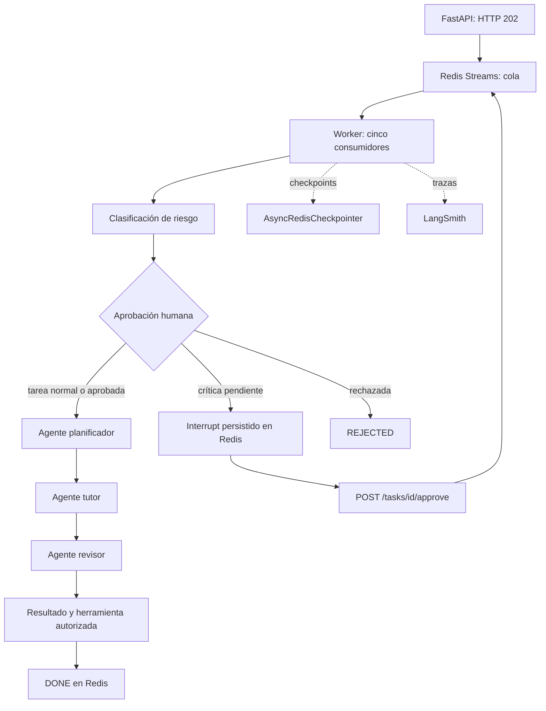

Tutor de programación · API multi-agente
======================================

**Pre-entrega 7 — API de producción y monitoreo activo**

Gerardo Samuel Torres López

API REST en Python 3.12+ que recibe una consulta, la encola en Redis y devuelve un `job_id` con HTTP **202**. Un worker separado coordina tres agentes con LangGraph: planificador, tutor y revisor. El cliente consulta el resultado sin mantener abierta una llamada al modelo.

El proyecto conserva el propósito y el prompt didáctico del tutor LCEL original. El repositorio de partida contenía una única cadena asíncrona; esta versión incorpora el grafo multi-agente y la infraestructura de la pre-entrega.

**Estado de la evidencia:** las capturas del dashboard deben generarse con claves reales de OpenAI y LangSmith. `screenshots/` contiene las instrucciones y los nombres esperados; no contiene evidencia simulada. Las pruebas usan un modelo de prueba y Redis real, y no demuestran costos ni trazas remotas.

Funcionamiento
--------------



| Capacidad | Implementación |
| --- | --- |
| API asíncrona | `POST /tasks`, `GET /tasks/{job_id}`; I/O Redis con `await` |
| Ejecución separada | `python -m app.worker`, Redis Streams y cinco consumidores |
| Estado durable | `PENDING`, `RUNNING`, `WAITING_APPROVAL`, `DONE`, `FAILED`, `REJECTED` |
| Checkpoints | `AsyncRedisCheckpointer`, equivalente a RedisSaver sobre `BaseCheckpointSaver` |
| Observabilidad | LangGraph/LangChain + decoradores `traceable`; trazas raíz `task_execution` |
| HITL | `interrupt()` + `Command(resume=...)` con el mismo `thread_id` |
| Evidencia de carga | Cinco POST concurrentes; metadatos `batch_id` y `job_id` |

Los tres agentes hacen llamadas LLM reales en producción. No hay modo de respuestas simuladas en la API. El worker usa `ainvoke()` y el endpoint HTTP solo escribe el estado y el mensaje en una transacción Redis.

Levantar con Docker Compose
--------------------------

Requisitos: Git, Docker con Compose y claves de OpenAI y LangSmith. El consumo del modelo se factura en la cuenta del proveedor.

```bash
git clone https://github.com/GerTorres9/AI-Engineering-Proyecto-1.git
cd AI-Engineering-Proyecto-1
cp .env.example .env
```

Edita `.env` y completa `OPENAI_API_KEY`, `LANGSMITH_API_KEY`, `API_TOKEN` y `APPROVAL_TOKEN`. Los dos tokens de acceso deben ser diferentes. Para generar un token local puedes usar `python3 -c 'import secrets; print(secrets.token_urlsafe(32))'` dos veces.

```bash
docker compose up --build -d
docker compose logs -f worker
```

- Documentación interactiva: <http://localhost:8000/docs>
- Esquema OpenAPI: <http://localhost:8000/openapi.json>
- Salud de API/Redis: <http://localhost:8000/health>

Redis usa un volumen, AOF y política `noeviction`. El checkpointer usa Redis estándar; no necesita módulos RedisJSON ni RediSearch. `docker compose down` conserva el volumen. Eliminarlo borra los trabajos y checkpoints.

Las claves se leen desde `.env`, que está excluido de Git y de la imagen. La API usa `API_TOKEN`; el endpoint de aprobación exige `APPROVAL_TOKEN`. Conserva este último para la persona responsable de aprobar. Los servicios se exponen en localhost para el piloto.

Alternativa: Python local y Redis en Docker
------------------------------------------

```bash
python3.12 -m venv .venv
source .venv/bin/activate
pip install -r requirements.txt
docker compose up -d redis
uvicorn app.main:app --host 127.0.0.1 --port 8000
```

En otra terminal, desde la misma carpeta:

```bash
source .venv/bin/activate
python -m app.worker
```

En esta modalidad usa `REDIS_URL=redis://localhost:6379/0`. Compose cambia la dirección a `redis://redis:6379/0` dentro de sus contenedores.

Enviar y consultar una tarea
----------------------------

En una terminal local, carga las variables de tu `.env`:

```bash
set -a
source .env
set +a
curl -s http://localhost:8000/tasks \
  -H "Authorization: Bearer $API_TOKEN" \
  -H 'Content-Type: application/json' \
  -d '{"pregunta":"¿Qué es la programación asíncrona?"}'
```

Respuesta inmediata, sin esperar al LLM:

```json
{"job_id":"<uuid>","status":"PENDING","status_url":"/tasks/<uuid>"}
```

Sustituye `<uuid>` por el identificador recibido:

```bash
curl -s "http://localhost:8000/tasks/<uuid>" \
  -H "Authorization: Bearer $API_TOKEN"
```

`DONE` incluye `result.answer`. `FAILED` incluye el tipo de error; los detalles técnicos están en el log y la traza. No se presenta un fallo de conexión como una ejecución correcta. También puedes usar `python orquestador_concurrente.py` como cliente CLI del tutor.

Aprobación humana
------------------

La clasificación de riesgo es del servidor. Una tarea exige aprobación si intenta guardar material, pide más tokens de salida que `CRITICAL_OUTPUT_TOKENS`, contiene más de 8,000 caracteres o solicita revisión explícita. El umbral de tokens es una política de consumo, no una estimación de dólares.

```bash
curl -s http://localhost:8000/tasks \
  -H "Authorization: Bearer $API_TOKEN" \
  -H 'Content-Type: application/json' \
  -d '{"pregunta":"Explica async y await","accion":"guardar_material"}'
```

Consulta el job hasta ver `WAITING_APPROVAL`. La propiedad `interrupt` explica el motivo. No se llama al LLM ni se guarda material mientras esta tarea crítica espera aprobación.

```bash
curl -s "http://localhost:8000/tasks/<uuid>/approve" \
  -H "Authorization: Bearer $APPROVAL_TOKEN" \
  -H 'Content-Type: application/json' \
  -d '{"approved":true,"note":"Autorizo guardar el material de estudio"}'
```

La API vuelve a encolarlo y el worker reanuda el checkpoint. Usa `approved:false` para rechazar; termina en `REJECTED`. La herramienta escribe el material en `tutor:materials:<job_id>` y es idempotente. Una segunda aprobación simultánea devuelve **409**. Puedes reiniciar API y worker mientras el job está pausado y aprobarlo después: el estado no depende de la memoria del proceso.

Cinco peticiones concurrentes
-----------------------------

Con API, Redis y worker levantados, instala las dependencias en tu entorno local si todavía no lo hiciste:

```bash
python3.12 -m venv .venv
source .venv/bin/activate
pip install -r requirements.txt
python -m scripts.load_test
```

El script libera cinco POST al mismo tiempo con `asyncio.gather`, comprueba HTTP 202 y hace polling hasta que los cinco jobs terminen. Guarda `artifacts/load-batch.json` con el `batch_id`, los cinco identificadores y sus trazas raíz. Cada tarea normal ejecuta tres agentes: la corrida completa tiene **15 llamadas LLM**. Los límites de la cuenta del proveedor pueden afectar el resultado; una corrida con errores debe repetirse antes de capturar evidencia.

El p95 mostrado por el cliente incluye la cola y el polling. Para la entrega utiliza el p95 de las ejecuciones trazadas, siguiendo el apartado siguiente.

Dashboard, costos y p95
-----------------------

1. Abre <https://smith.langchain.com> y entra al proyecto configurado en `LANGSMITH_PROJECT`.
2. Filtra por el tag `batch_id` que imprimió la carga y por las trazas raíz `task_execution`. Deben aparecer exactamente cinco ejecuciones completadas.
3. Abre una traza: verifica los nodos, las tres llamadas LLM, su duración y sus tokens de entrada/salida. Captura la lista y el árbol de una ejecución.
4. Muestra la columna de costo de las cinco ejecuciones. LangSmith calcula el costo desde los tokens reales y el precio del modelo identificado por LangChain. Si no aparece costo, revisa modelo/proveedor y la tabla **Model pricing** antes de repetir la corrida.
5. En **Monitoring**, filtra el mismo proyecto y la misma corrida. Si la interfaz ofrece percentil 95, selecciona p95 de latencia de las cinco trazas raíz. No uses p50 ni p99 como sustituto.

Para leer la corrida de forma reproducible:

```bash
python -m scripts.monitoring
```

El script toma el costo calculado por LangSmith, obtiene el p95 mediante interpolación lineal de los cinco tiempos de las trazas raíz y señala qué agente acumula más tokens y más tiempo de LLM. Guarda el resultado en `artifacts/langsmith-metrics.json`. Los tiempos de nodos se suman para comparar su contribución; no equivalen al tiempo total de pared de cinco trabajos paralelos.

**Cuando la interfaz solo ofrece p50/p99:** publica el p95 de esta corrida como un feedback numérico:

```bash
python -m scripts.monitoring --publish-p95
```

En el dashboard crea un gráfico de **Feedback score**, selecciona `batch_latency_p95_seconds`, usa **Average** y filtra solo esa corrida. El mismo p95 se adjunta a las cinco trazas, por lo que su promedio muestra ese valor. Titula el gráfico “p95 de cinco ejecuciones (segundos; derivado de trazas)”. Esta alternativa hace visible en el dashboard un percentil calculado desde tiempos reales; el costo sigue siendo el cálculo automático de la plataforma.

Guarda en `screenshots/`:

| Archivo | Qué debe verse |
| --- | --- |
| `01-trazas-corrida.png` | Cinco trazas raíz, mismo batch y estado completado |
| `02-detalle-nodos.png` | Árbol de una traza, duración y tokens por agente |
| `03-costo-por-ejecucion.png` | Costos automáticos de las cinco ejecuciones |
| `04-latencia-p95.png` | p95, unidad, filtro de corrida y origen de la métrica |
| `05-hitl.png` | Pausa y reanudación de una tarea crítica, en una corrida aparte |

Compara los resultados de `scripts.monitoring` con el árbol del dashboard para identificar el nodo con más latencia y el que consume más tokens. No publiques capturas con claves ni datos personales. Los JSON ayudan a identificar la corrida, pero **no reemplazan las capturas del dashboard**.

Errores, recuperación y límites
-------------------------------

Las excepciones del grafo y los timeouts terminan en `FAILED`; el mensaje se confirma y el cliente puede detener el polling. Si Redis no está disponible, el worker no confirma el mensaje y la API responde 503. Si un proceso cae, otro consumidor reclama el mensaje tras `JOB_TIMEOUT_SECONDS + 60` segundos y continúa el checkpoint. Los trabajos fallidos no se reintentan automáticamente.

La cola y los checkpoints usan persistencia durable, pero el piloto depende de una instancia de Redis. No incorpora alta disponibilidad, aislamiento por usuario ni una infraestructura pública con TLS. Para el ejercicio, los tokens separan la operación normal de la aprobación y Compose conserva los datos durante reinicios.

Pruebas
--------

Las pruebas de integración necesitan una base Redis dedicada; la suite borra esa base. Por defecto usa la base **15**:

```bash
docker compose up -d redis
source .venv/bin/activate
pip install -r requirements-dev.txt
TEST_REDIS_URL=redis://localhost:6379/15 pytest -q
```

Verifican concurrencia, persistencia de interrupciones, aprobación única, rechazo, captura de fallos, autenticación y recuperación de mensajes abandonados. La suite usa un modelo determinista solo en tests, sin llamadas pagadas. GitHub Actions ejecuta estas pruebas con Redis y Python 3.12.

Estructura
-----------

| Ruta | Contenido |
| --- | --- |
| `app/main.py` | Endpoints y autenticación |
| `app/graph.py` | Grafo y agentes didácticos |
| `app/worker.py` | Consumidores async, errores y recuperación |
| `app/store.py` | Jobs, cola y aprobación atómica |
| `app/checkpointer.py` | Checkpoints y pending writes en Redis |
| `app/hitl.py` | Interrupción para aprobación externa |
| `app/observability.py` | Configuración de LangSmith y modelo |
| `scripts/` | Carga concurrente y lectura de métricas reales |
| `tests/` | Pruebas con Redis |
| `screenshots/` | Evidencia real del dashboard por agregar |
| `requirements.txt` | Dependencias de ejecución fijadas |
| `docker-compose.yml` | API, worker y Redis persistente |

Las dependencias directas están en `requirements.in`; `requirements.txt` fija también las transitivas. Para actualizar el lock de manera deliberada usa `uv pip compile requirements.in -o requirements.txt`.

Revisión antes de entregar
--------------------------

- Ejecutar la suite con Redis.
- Ejecutar la carga real: cinco `DONE` y quince llamadas LLM visibles.
- Agregar las capturas del dashboard, costos, p95 y HITL.
- Confirmar que `.env` y las claves no estén versionadas.
- Publicar el repositorio y probar un clon nuevo con los comandos de instalación.

Referencias técnicas
--------------------

- [Persistencia de LangGraph](https://docs.langchain.com/oss/python/langgraph/persistence)
- [Interrupts y Human-in-the-loop](https://docs.langchain.com/oss/python/langgraph/interrupts)
- [Seguimiento de costos en LangSmith](https://docs.langchain.com/langsmith/cost-tracking)
- [Dashboards de monitoreo](https://docs.langchain.com/langsmith/dashboards)
